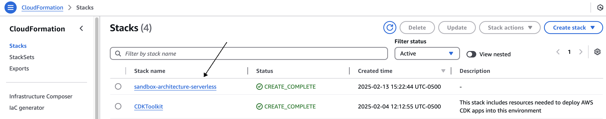

# Messaging Component

A CDK TypeScript project that handles messaging infrastructure and components.

## 📝 Description

This project implements messaging infrastructure using AWS CDK with TypeScript. It provides a robust messaging system leveraging AWS services for reliable message processing and delivery.

## 🔧 Prerequisites

- Node.js (v18.x or later)
- AWS CLI configured with appropriate credentials
- AWS CDK CLI installed (`npm install -g aws-cdk`)
- TypeScript knowledge

## ⚙️ Installation

1. Clone the repository
2. Install dependencies:
```bash
npm install
```

With the previously made configurations, we proceed to check the installation and version of the AWS CDK Toolkit, with the following command:
```bash
cdk --version
```

## 📁 Project Structure

```
messaging-component/
├── lib/                    # CDK stack definitions
├── bin/                    # CDK app entry point
├── test/                   # Test files
└── cdk.json                # CDK configuration
```

## 🚀 Available Scripts

```bash
# Deploy stack to AWS
cdk deploy -c env=<environment>

# Show changes between deployed stack and current state
cdk diff -c env=<environment>

# Synthesize and print CloudFormation template
cdk synth -c env=<environment>

# Bootstrap sandbox environment
cdk bootstrap -c env=<environment>

```

Note: Replace `<environment>` with your target environment (e.g., sandbox, dev, prod)

## 📦 Deployment

Make sure your AWS credentials are configured

This project uses CDK context to manage different environments. All CDK commands require the environment context parameter:

```bash
# Example commands
cdk bootstrap -c env=sandbox # Bootstrap sandbox environment
cdk deploy -c env=sandbox    # Deploy to sandbox environment
cdk diff -c env=sandbox      # Check changes in sandbox environment
cdk synth -c env=sandbox     # Synthesize template for sandbox environment
```

1. CDK Bootstrap, bootstrapping is a unique configuration process per region and AWS account, we will use the following command (This process is only required for accounts that do not have a bootstrap already deployed):

```bash
cdk bootstrap -c env=sandbox
```
Purpose:

* Create a special S3 bucket that CDK uses to store assets
* Configure IAM roles required for deployment
* Establishes the base infrastructure that CDK needs for deployments
* Create a CloudFormation stack called “CdkToolkit”

When you need to:

* First time using CDK in an account/region
* When bootstrap policies are updated
* When working with new features that require a specific version of the bootstrap

At the successful completion of the execution of the command, we can validate the CdkToolkit stack in the console of the AWS service called CloudFormation


2. To synthesize the CDK template, which is the process of converting the CDK code into a CloudFormation template, we will use the following command:
```bash
cdk synth -c env=sandbox
```
Purpose:

* Validates the configuration and structure of the CDK code
* Resolve all references and dependencies between resources
* Generate a CloudFormation template in YAML/JSON format
* Allows you to review exactly what resources will be created before deployment
* Detect configuration errors early
* Facilitates infrastructure versioning

Output:

* Generate the cdk.out/ [stack-name] .template.json file
* Create required manifests and asset files
* Show the CloudFormation template in the console

3. Deployment, carry out the effective deployment of the infrastructure on AWS, we will use the following command:
```bash
cdk deploy -c env=sandbox
```
Purpose:

* Run synth internally
* Upload the necessary assets to the bootstrap bucket
* Create or update the stack in CloudFormation
* Show progress in real time
* Handle automatic rollbacks in case of error

Deployment monitoring:

* Show CloudFormation events in real time
* Indicates resource changes
* Provides information on defined outputs
* Report errors and rollback states

This sequence of commands (bootstrap → synth → deploy) ensures a controlled and repeatable deployment of the infrastructure, allowing early detection of errors and facilitating continuous maintenance of the solution.

Verification of deployment

Once the deployment is complete, we can verify the implementation:

Access the AWS console and verify the creation of resources:



## 🏗️ Architecture


Our architecture is built on Amazon EventBridge as the central orchestration component, acting as an enterprise event bus. This service enables us to implement a truly event-driven architecture, where each message can trigger specific workflows based on its nature and destination.

The solution uses Amazon Simple Queue Service (SQS) as a buffer to ensure message durability and handle load spikes. When an event enters the system through EventBridge, the configured rules determine its route: either to the email queue or the SMS queue.

Lambda functions act as event processors, consuming messages from SQS queues and performing necessary transformations. For emails, the corresponding Lambda function retrieves HTML templates stored in Amazon S3 and personalizes them according to the event data. For the personalization process, we use Handlebars, a JavaScript library that provides the necessary power to create semantic templates effectively and without frustration.

For SMS, another Lambda function processes the message content according to the specific requirements of this channel.

Amazon Simple Email Service (SES) handles reliable email delivery, while Amazon Simple Notification Service (SNS) manages SMS sending. Both services provide detailed tracking and metrics capabilities.

Amazon DynamoDB stores critical metadata, such as template configurations, user preferences, and delivery logs, allowing fast and consistent access to this information.

## Clean up
```bash
cdk destroy -c env=sandbox
```
During the execution of the cdk destroy command:

1. CDK will show a summary of all the resources that will be deleted
2. You will request confirmation before proceeding with the deletion.
3. It will execute the deletion in the correct order, respecting the dependencies between resources
4. It will provide real-time feedback on the progress of the elimination

Post-cleaning check

After running cdk destroy, it is recommended to verify:

1. The AWS CloudFormation console to confirm that the stack has been completely deleted
2. That there are no orphan resources left in the following services:

* CloudWatch Logs (log groups can persist)
* S3 (verify that the buckets have been emptied and deleted)
* DynamoDB (confirm the removal of the tables)

## Security

See [CONTRIBUTING](CONTRIBUTING.md#security-issue-notifications) for more information.

## License

This library is licensed under the MIT-0 License. See the LICENSE file.

